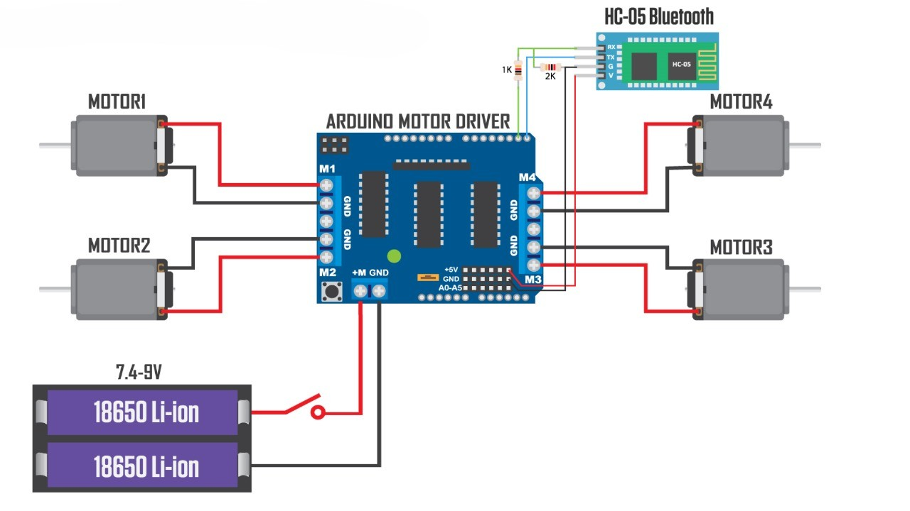
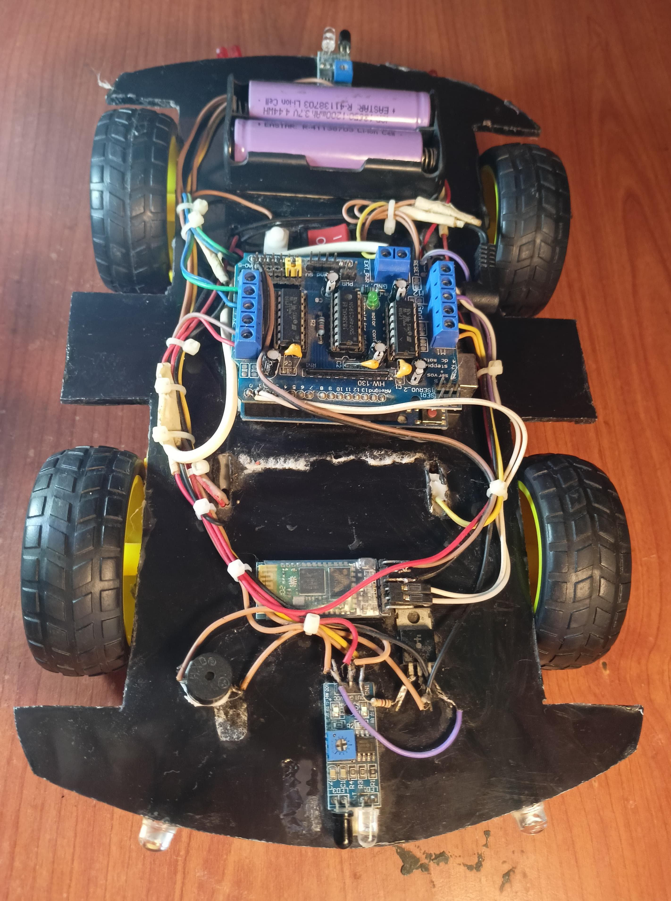

# 🚗 Bluetooth Controlled Car using Arduino Uno and L293D Motor Driver

A Bluetooth-controlled smart car built using Arduino Uno, L293D Motor Driver, and HC-05 Bluetooth module. This car can be controlled wirelessly using a smartphone app like **Bluetooth RC Controller**.

---

## 📦 Features

- 🔧 Arduino Uno-based wireless car
- 🎮 Control via Android Bluetooth App
- ⚙️ Uses L293D Motor Driver for motor control
- 🔋 Powered with a 7.4V LiPo battery

---

## 🖼️ Images

| Circuit Diagram | Finished Car |
|-----------------|--------------|
|  |  |

---

## 🧠 Components Used

- Arduino Uno
- HC-05 Bluetooth Module
- L293D Motor Driver
- 4x DC Motors
- Wheels
- Wooden Base or Chassis
- 7.4V LiPo Battery

---

## 💻 Code

The full code is inside the `Code` folder:  
📁 `Code/bluetooth_car.ino`

---

## 📲 How to Use

1. Upload code to Arduino Uno
2. Connect HC-05 Bluetooth to phone
3. Use **Bluetooth RC Controller** app
4. Use buttons:
   - F = Forward
   - B = Backward
   - L = Left
   - R = Right
   - S = Stop

---

## 🧑‍💻 Author

**Rajarshi Ghosh**  
GitHub: [@ghoshrajarshi425](https://github.com/ghoshrajarshi425)
